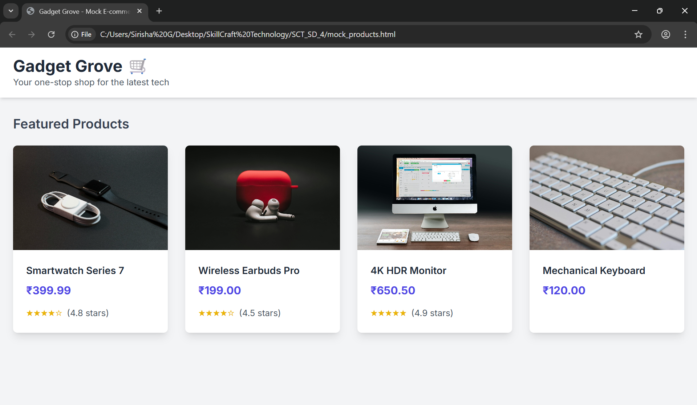
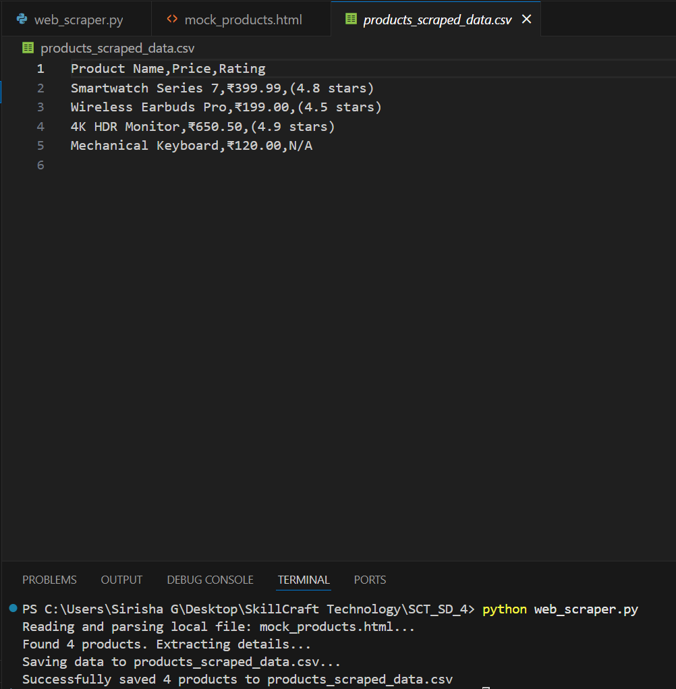

# E-commerce Web Scraper 🛒

A Python-based web scraper designed to extract product information from a mock e-commerce website and store the data in a structured CSV file.

---

## About
This project is a practical demonstration of web scraping built with **Python** and the **BeautifulSoup** library.

The script parses a local HTML file, extracts key details like product names, prices, and ratings, and then saves this information into a `products_scraped_data.csv` file for easy analysis.

---

## Features
-   **Data Extraction**: Scrapes product names, prices, and ratings from a static HTML page.
-   **CSV Export**: Automatically saves the collected data into a clean, well-structured CSV file.
-   **Robust Parsing**: Gracefully handles missing information, such as a product without a rating.
-   **Self-Contained Demo**: Includes a stylish mock e-commerce page so the scraper can be tested immediately.
-   **Clean & Commented Code**: The Python script is easy to understand, making it perfect for learning.
-   **Separation of Concerns**: The mock website's structure (HTML) and design (CSS) are kept in separate files.

---

## E-commerce Web Scraper - Output Screenshots
Here are some sample screenshots of the E-commerce Web Scraper project:






---

## Getting Started

### Prerequisites
-   **Python 3.x** installed on your system.
-   A text editor (like VS Code) to save the files.

### How to Run

1.  **Clone the repository (or create the files manually):**
    ```bash
    git clone <your-repository-url>
    cd <your-repository-folder>
    ```
    Alternatively, create a new folder and add three files: `mock_products.html`, `style.css`, and `web_scraper.py`.

2.  **Add the Code**: Ensure the complete code for each of the three files is in its respective file.

3.  **Install Dependencies**: Open your terminal or command prompt and install the required Python library using pip.
    ```bash
    pip install beautifulsoup4
    ```

4.  **Run the Scraper**: First, open the `mock_products.html` file in your web browser to see the target website. Then, execute the Python script from your terminal.
    ```bash
    python web_scraper.py
    ```

---

## Usage

-   After running the script, a confirmation message will appear in the terminal.
-   A new file, `products_scraped_data.csv`, will be created in the same directory.
-   You can open this CSV file with any spreadsheet program (like Excel or Google Sheets) to view the extracted data. 🎉

---

## License

This project is open source and free to use.

---

## Contact

For questions or feedback, feel free to reach out.

---

✨ Thank you for checking out the E-commerce Web Scraper project!
